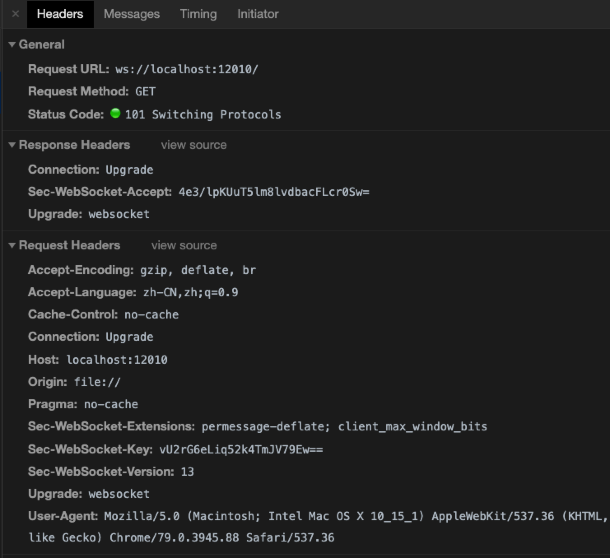

# nodejs webSocket 实现原理浅析
## 前言
### 客户端与服务器端实时通讯的三种模式：
> __短轮询__: 控制客户端的页面不断的进行ajax请求，应该很好实现吧。js定时器就可以实现，每次请求如果服务器端有更新数据则响应到客户端。但是这会造成服务器的严重压力，如果在线用户数量过多的话，每隔个一两秒请求一次，哪个服务器能受得了，这种肯定不太现实，或者是最无奈的实现方法。

> __comet__: comet技术是服务器推技术的一个总称，但不是具体实现方式。目前常见的实现方式有两种：长轮询和流方式
   >> __长轮询（long-polling)__: 长轮询就是页面向服务器发起一个请求，服务器一直保持tcp连接打开，知道有数据可发送。发送完数据后，页面关闭该连接，随即又发起一个新的服务器请求，在这一过程中循环费。
   >> __流方式__: http流不同于上述两种轮询，因为它在页面整个生命周期内只使用一个HTTP连接，具体使用方法即页面向浏览器发送一个请求，而服务器保持tcp连接打开，然后不断向浏览器发送数据。

> __WebSocket__: 长连接和长轮询都比较消耗服务器资源，在这种情况下HTML5定义了webSocket协议，能更好的节省服务器资源和宽带，并且能够更实时地进行通讯。WebSocket是一种在单个TCP连接上进行全双工通信的协议。WebSocket使得客户端和服务器之间的数据交换变得更加简单，允许服务端主动向客户端推送数据。在WebSocket API中，浏览器和服务器只需要完成一次握手，两者之间就直接可以创建持久性的连接，并进行双向数据传输.

### websocket 的优点
> __较少的控制开销__: 在连接创建后，服务器和客户端之间交换数据时，用于协议控制的数据包头部相对较小。在不包含扩展的情况下，对于服务器到客户端的内容，此头部大小只有2至10字节（和数据包长度有关）；对于客户端到服务器的内容，此头部还需要加上额外的4字节的掩码。相对于HTTP请求每次都要携带完整的头部，此项开销显著减少了。
> __更强的实时性__: 由于协议是全双工的，所以服务器可以随时主动给客户端下发数据。相对于HTTP请求需要等待客户端发起请求服务端才能响应，延迟明显更少；即使是和Comet等类似的长轮询比较，其也能在短时间内更多次地传递数据。
> __保持连接状态__。与HTTP不同的是，Websocket需要先创建连接，这就使得其成为一种有状态的协议，之后通信时可以省略部分状态信息。而HTTP请求可能需要在每个请求都携带状态信息（如身份认证等）。
> __更好的二进制支持__。Websocket定义了二进制帧，相对HTTP，可以更轻松地处理二进制内容。
> __可以支持扩展__。Websocket定义了扩展，用户可以扩展协议、实现部分自定义的子协议。如部分浏览器支持压缩等。
> __更好的压缩效果__。相对于HTTP压缩，Websocket在适当的扩展支持下，可以沿用之前内容的上下文，在传递类似的数据时，可以显著地提高压缩率。

## websocket 原理
### websocket 握手
客户端建立连接时，通过 HTTP 发起请求报文，在浏览器中截图如下：

与普通的 HTTP 请求，区别的部分主要在于这些协议头：

- 升级协议
> Upgrade: websocket
> Connection: Upgrade

- 安全校验
> Sec-WebSocket-Key: vU2rG6eLiq52k4TmJV79Ew==

- 指定版本号
> Sec-WebSocket-Version: 13

经过协议的升级，服务器返回：
> Status Code: 101 Switching Protocols
> Connection: Upgrade
> Sec-WebSocket-Accept: 4e3/lpKUuT5lm8lvdbacFLcr0Sw=
> Upgrade: websocket

经过上述过程，握手完成。

### websocket 报文组成


- FIN: 占 1bit
> 0：不是消息的最后一个分片
> 1：是消息的最后一个分片

- RSV1, RSV2, RSV3：各占 1bit
> 一般情况下全为 0。当客户端、服务端协商采用 WebSocket 扩展时，这三个标志位可以非
0，且值的含义由扩展进行定义。如果出现非零的值，且并没有采用 WebSocket 扩展，连接出错。

- Opcode: 4bit
> %x0：表示一个延续帧。当 Opcode 为 0 时，表示本次数据传输采用了数据分片，当前收到的数据帧为其中一个数据分片；
> %x1：表示这是一个文本帧（text frame）；
> %x2：表示这是一个二进制帧（binary frame）；
> %x3-7：保留的操作代码，用于后续定义的非控制帧；
> %x8：表示连接断开；
> %x9：表示这是一个心跳请求（ping）；
> %xA：表示这是一个心跳响应（pong）；
> %xB-F：保留的操作代码，用于后续定义的控制帧。

- Mask: 1bit
> 表示是否要对数据载荷进行掩码异或操作。
> 0：否
> 1：是

- Payload length: 7bit or (7 + 16)bit or (7 + 64)bit
> 表示数据载荷的长度
> 0~126：数据的长度等于该值；
> 126：后续 2 个字节代表一个 16 位的无符号整数，该无符号整数的值为数据的长度；
> 127：后续 8 个字节代表一个 64 位的无符号整数（最高位为 0），该无符号整数的值为数据的长度。

- Masking-key: 0 or 4bytes
> 当 Mask 为 1，则携带了 4 字节的 Masking-key；
> 当 Mask 为 0，则没有 Masking-key。
> 掩码算法：按位做循环异或运算，先对该位的索引取模来获得 Masking-key 中对应的值 x，然后对该位与 x 做异或，从而得到真实的 byte 数据。
> 注意：掩码的作用并不是为了防止数据泄密，而是为了防止早期版本的协议中存在的代理缓存污染攻击（proxy cache poisoning attacks）等问题。

- Payload Data: 载荷数据

## 实现
### 客户端 javascript 实现
```javascript
var websocket = new WebSocket("ws://"+host+"/");
websocket.onopen = function(){
    console.log("open");
    isOK = true;
};

websocket.onmessage = function(e) {
  var data = e.data
  // do something
};

websocket.onclose = function(){
    console.log("close");
    isOK = false;

    // 断开重试
    setTimeout(function(){
      ws = createWebsocket();
    } , 2000);
};
```

### 服务器端 nodejs 实现
```javascript
const EventEmitter = require("events").EventEmitter;

var webSocketCollector = [];

// 创建WebSocket类并继承事件类
class WebSocket extends EventEmitter {
  constructor(socket) {
    super();

    this.state = "OPEN";

    this.pingTimes = 0;

    this.socket = socket;

    this.receiver = null;

    this.bind();

    this.checkHeartBeat();

    Object.defineProperty(this, 'connectLength', {
      get: function() {
        return webSocketCollector.length;
      }
    });

    webSocketCollector.push(this);
  }

  /**
   * 关闭链接
   * @return {[type]}
   */
  close(reason) {
    var index;

    if (this.state === "CLOSE") return;

    if ((index = webSocketCollector.indexOf(this)) + 1) {
      webSocketCollector.splice(index, 1);
    }

    this.emit('close', reason);

    this.state = "CLOSE";

    this.socket.destroy();
  }

  /**
   * 广播信息
   * @param  {String} message
   */
  brocast(message) {
    webSocketCollector.forEach(function(ws) {
      ws.send(message);
    });
  }

  /**
   * 对socket进行事件绑定
   */
  bind() {
    var that = this;

    this.socket.on('data', function(data) {
      that.dataHandle(data);
    });

    this.socket.on('close', function(e) {
      that.close(e);
    });

    this.socket.on('error', function(e) {
      that.close(e);
    });
  }

  /**
   * socket有数据过来的处理
   * @return {[type]}
   */
  dataHandle(data) {
    var receiver = this.receiver;

    if (!receiver) {
      receiver = decodeFrame(data);

      if (receiver.opcode === 8) { // 关闭码
        this.close(new Error("client closed"));
        return;
      } else if (receiver.opcode === 9) { // ping码
        this.sendPong();
        return;
      } else if (receiver.opcode === 10) { // pong码
        this.pingTimes = 0;
        return;
      }

      this.receiver = receiver;

    } else {
      // 将新来的数据跟此前的数据合并
      receiver.payloadData = Buffer.concat(
        [receiver.payloadData, data],
        receiver.payloadData.length + data.length
      );

      // 更新数据剩余数
      receiver.remains -= data.length;
    }

    // 如果无剩余数据，则将receiver置为空
    if (receiver.remains <= 0) {
      receiver = parseData(this.receiver);

      this.emit('message', receiver);

      this.receiver = null;
    }
  }

  /**
   * 发送数据
   * @param  {String} message 发送的信息
   * @return {[type]}
   */
  send(message) {
    if (this.state !== "OPEN" && this.socket.writable) return;

    this.socket.write(encodeFrame(message));
  }

  /**
   * 心跳检测
   */
  checkHeartBeat() {
    var that = this;
    setTimeout(function() {
      if (that.state !== "OPEN") return;

      // 如果连续3次未收到pong回应，则关闭连接
      if (that.pingTimes >= 3) {
        that.close("time out");
        return;
      }

      //记录心跳次数
      that.pingTimes++;
      that.sendPing();

      that.checkHeartBeat();
    }, 20000);
  }

  /**
   * 发送ping
   */
  sendPing() {
    this.socket.write(new Buffer(['0x89', '0x0']))
  }

  /**
   * 发送pnong
   */
  sendPong() {
    this.socket.write(new Buffer(['0x8A', '0x0']))
  }
}
```

具体实现请参考源文件 socket.js 或 socket_v2.js


## demo 运行方式
- clone 项目
- 在项目根目录运行命令，启动服务器端
```shell
node start.js
```
- 在浏览器端打开 client.html 文件，即可看到客户端和服务器端简历了 socket 了解，服务器端可定时给客户端发送消息
具体实现请参考源文件 socket.js 或 socket_v2.js